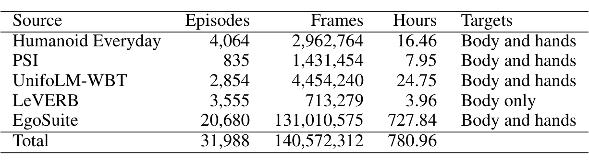
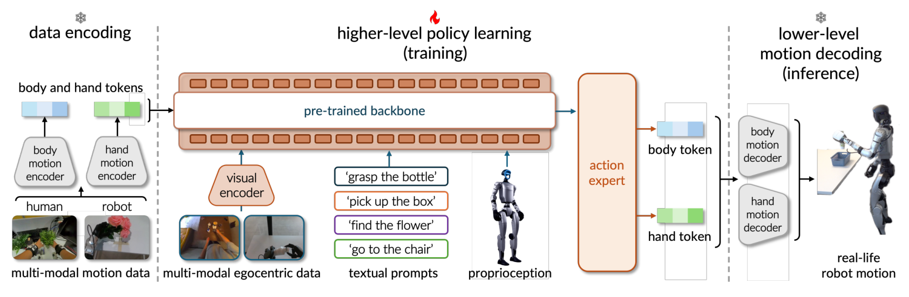
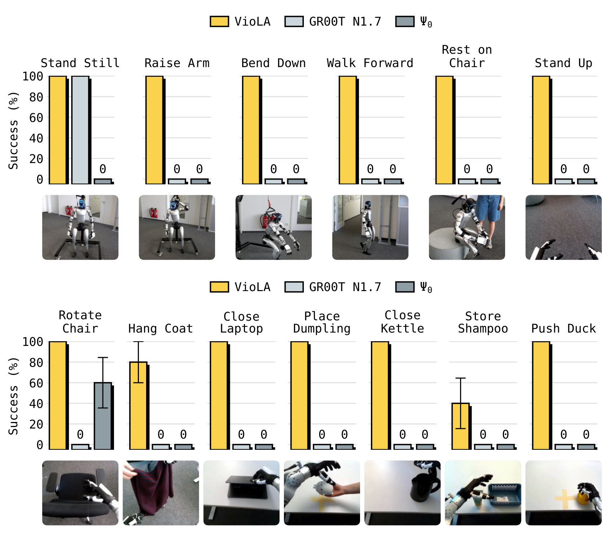
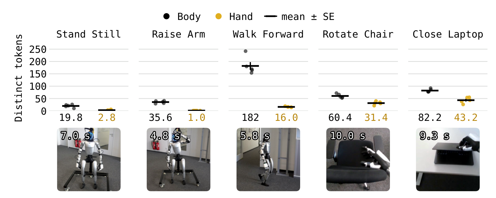
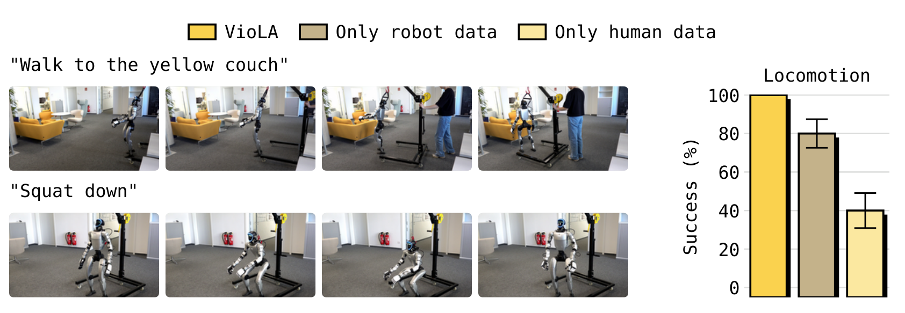

# VioLA: Learning Generalist Humanoid Control Policies from Human Data

> arXiv:2610.12435v1（2026-10-09 01:57 北京时间提交）· Mert Albaba, Jens Beißwenger, Anna Manasyan, Daniel Marta, Michael J. Black, Wieland Brendel, Andreas Krause, Georg Martius, Martin Riedmiller · [摘要页](https://arxiv.org/abs/2610.12435)
>
> 一句话：把策略的预测目标从关节指令换成「身体+手的运动潜变量」，冻结的运动编码器把人类与机器人运动映射进同一潜空间——人类录像因此直接成为策略动作空间里的标注；140.6M 帧（93.2% 人类）训练后，Unitree G1 上零样本（无任务微调）30/30 运动、31/35 操作，对照 released GR00T N1.7 的 5/30 与 Ψ0 的 3/35。

## 为什么改预测目标就能用人类数据

教仿人机器人跟随指令，论文开头指出两个硬障碍。第一，动作空间大且紧耦合：腿、臂、手指必须一起动还要保持平衡，关节级动作很难直接学。第二，仿人演示稀缺——现有通用策略不跟随新指令，部署前要对每个任务做遥操作演示微调；而人类演示量级大得多，但「一个人的运动不是一条机器人指令」。

VioLA 的回答是不去翻译运动，而是换掉策略的输出目标。策略不再预测关节命令，改预测 **body 和 hand 的运动潜变量**：预训练的身体/手控制器负责把这些潜变量在机器人上执行，对应的运动编码器把人类与机器人运动映射到**同一个潜空间**。于是「一段人类录像」在策略的动作空间里就是带标注的演示——人类数据不再需要重定向。

*Figure 1：VioLA 总览——人类/真机/仿真三路数据经冻结运动编码器进入共享潜空间，通用策略预测运动潜变量，冻结控制器执行*

这个设计的选择值得注意：**我的分析**是它把 embodiment gap 从「轨迹级重定向问题」（人类手到机器人手的几何变换）压缩成「潜空间对齐问题」（两个编码器映射到同一坐标系），后者靠预训练编码器一次性解决，策略训练完全不用碰。

## 机制流程：从人类录像到机器人执行

把一个输入走完整条链路：

1. **编码**（冻结，训练前后不变）：body 编码器（SONIC v1.1）与 hand 编码器把人类或机器人运动转成 64 坐标运动码——两个 32 维 FSQ 码展平，坐标取值 {k/16: −16…15}，每个码总结从当前帧开始的 10 帧参考窗（机器人编码器读偏移 0/5/…/45 帧，人类编码器读连续 10 帧）。
2. **策略预测**：通用策略（骨干+action expert）从视觉、语言、本体感知预测 128 坐标潜 chunk——64 body + 64 hand，GR00T 变体预测 H=40 步。人类录像转成的潜码直接作为动作标签参与训练。
3. **执行**（冻结）：body 控制器与 hand 解码器把潜 chunk 转成关节/手指命令，控制器利用机器人实时状态把潜变量翻译成协调动作；跨 chunk 切换用 RTC（real-time chunking，把推理期间要执行的潜变量作为条件）保持连续。

训练调度是 **human-then-mixed**：先在人类演示上 150k 步，再在五语料均匀混合 50k 步。数据池见下表——人类演示占 93.2%。

*Table 1：转换后的演示池——EgoSuite 131M 帧占绝对主导，总计 140.6M 帧 / 780.96 小时*

| 来源 | Episodes | 帧 | 小时 | 目标 |
|---|---:|---:|---:|---|
| Humanoid Everyday | 4,064 | 2,962,764 | 16.46 | 身体+手 |
| PSI | 835 | 1,431,454 | 7.95 | 身体+手 |
| UnifoLM-WBT | 2,854 | 4,454,240 | 24.75 | 身体+手 |
| LeVERB | 3,555 | 713,279 | 3.96 | 仅身体 |
| EgoSuite（人类） | 20,680 | 131,010,575 | 727.84 | 身体+手 |
| **合计** | 31,988 | 140,572,312 | 780.96 | — |

## 关键结果：零样本真机与两条基线

评测在作者的实验室 Unitree G1（五指 Inspire 手）上进行：6 个运动/姿态任务（LeVERB 指令）+ 7 个操作任务（Humanoid Everyday 指令），每策略每任务 5 次。held out 的是 episodes、实验室环境、物体实例——任务族与训练语料重叠，这里的「零样本」指**无任务特定微调**。

*Figure 2：VioLA 三段式管线——数据编码、策略学习（火焰=训练）、运动解码（雪花=推理）*

**论文证据**（Figure 3，五次/任务、一个标准误）：

- 运动/姿态：VioLA **30/30**；released GR00T N1.7 仅 stand still 成功（**5/30，16.7%**）；Ψ0 **0/30**。
- 操作：VioLA **31/35（88.6%）**——Rotate Chair / Close Laptop / Place Dumpling / Close Kettle / Push Duck 全过，Hang Coat 4/5、Store Shampoo 2/5；GR00T N1.7 **0/35**；Ψ0 仅 chair rotation 3/35（8.6%）。

*Figure 3：13 任务成功柱状图——VioLA 运动 30/30、操作 31/35，released GR00T N1.7 与 Ψ0 大面积归零*

四次失败集中在「够到物体并保住它」：Store Shampoo 失败里机器人在伸手时碰倒瓶子；Hang Coat 一次失败是拿到衣服后在折返中途掉落。**作者主张**这解释了操作与运动的差别——成功操作需要正确的 reach-grasp-release 序列贯穿到任务结束，成功身体运动只要求正确发起。单独的 bottle carrying 任务（附录 A.7）所有 VioLA 变体 5 次全败，失败阶段分散在抓取时机、抓-走转换、直立释放；计入后操作成功率从 88.6% 降到 31/40（77.5%）。

**预测的是运动不是关节**：论文统计了完整执行中互不相同运动单元（distinct motion tokens）的个数（相似预测归并计数，附录 A.10 校准）——chair rotation 平均 60.4 个 body 单元 + 31.4 个 hand 单元、laptop closing 82.2 + 43.2 个，各约 10 秒；walking 需要 182 个 body 单元。**我的分析**：这个计数把「为什么潜变量目标更容易学」具体化了——复杂执行只需几十个不同的运动预测，协调细节由冻结控制器在每个控制步补齐，策略学的是「何时产生哪个运动」。

*Figure 5：五任务的运动单元计数——复杂操作约需 60-82 个 body 运动单元 与 31-43 个 hand 运动单元*

## 消融：人类数据到底贡献了什么

三组对照（同一 GR00T 骨干、同一冻结运动模块）：

1. **human-only**：12/30 运动（40%）——4/5 弯腰、3/5 行走、2/5 坐下、3/5 起身，站定与举臂为零。编码人类运动**确实**能作动作监督、零机器人演示迁移到真机，但覆盖不全。
2. **robot-only vs human-then-mixed**（各 200k 步）：运动 24/30 vs **30/30**——差距全部来自 bend（robot-only 5 次全败）与一次坐姿；操作反过来：robot-only **33/35（94.3%）** vs 31/35（88.6%）。

*Figure 6：人类演示的贡献——human-only 12/30、robot-only 24/30、human-then-mixed 30/30（运动）*

**我的分析**：人类数据不是万灵药而是任务依赖的补丁——它补的是机器人语料缺的身体运动（bend），而机器人演示仍更会抓取物体（shampoo 5/5 vs 2/5）。论文没有给出如何兼得的答案，作者在限制一节明说这是 open question。

**骨干可移植性**：同数据同预算换骨干（两个 VLA + 一个 WAM，各保留自己的学习目标）——GR00T 与 DiT4DiT 运动 30/30，π0.5 变体 20/30（行走与完整弯腰失败）；操作上分化剧烈：GR00T 31/35 vs π0.5 16/35（45.7%）vs DiT4DiT 9/35（25.7%）。预测延迟 GR00T 160.2ms / π0.5 208.6ms / DiT4DiT 248.5ms——50Hz 下每次预测占 8-12 个控制步，这正是 RTC 成为必要组件的原因：**论文证据**显示 RTC 关闭时 body 潜变量在 chunk 切换处出现尖峰、开启后接近背景波动。

## 边界与不能下的结论

作者自述三条限制，配上**我的分析**：

- **能力受限于冻结模块**：策略超不出控制器能执行的运动范围；hand 解码器输出手指位置命令、无接触力反馈——Hang Coat / bottle carrying 类「抓取保持」失败集中暴露在这里。补接触反馈是论文指名的改进方向。
- **依赖人类动作标注**：扩展到任意视频受运动估计可靠性限制。
- **评测规模**：一台 G1、13 任务、5 次/任务；任务族与训练语料重叠。跨任务/环境/本体的可靠性**尚不能确定**。

复现角度最有用的三件东西：human-then-mixed 两段调度（150k+50k）可直接照抄；运动潜空间标注管线（编码器冻结、潜码即标签）对任何有人类演示的团队都是即插即用；每任务 5 次 × 13 任务的快速真机协议 + 「任务族重叠、episodes/环境/物体 held out」的划分方式值得作为小规模评测模板。

**尚不能确定**的：手部接触力反馈接入后抓取保持类失败能否消除；human-then-mixed 对操作的 −5.7 点能否用第三段机器人回炉补回；潜空间方法在双臂协调与全身接触富任务上的上限。

代码与 checkpoints 论文承诺发布（本日核查未见独立仓库）；无独立项目页。
